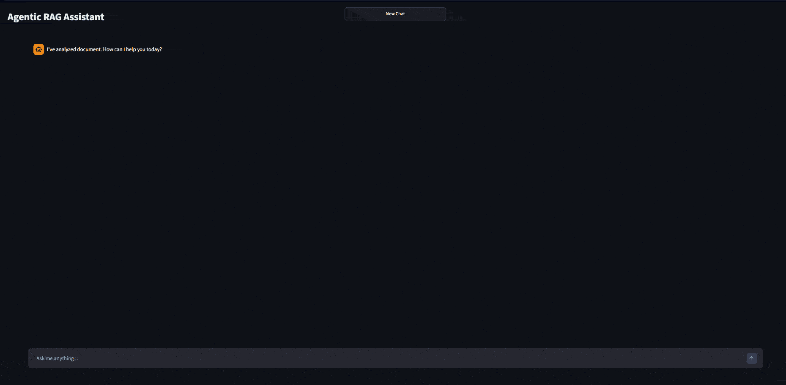

# 🤖 AGENTIC RAG ASSISTANT

AI Assistant that performs **Retrieved Augmented Generation** using autonomus agents. It combines local document knowledge and web search to deliver answers.
It uses **ReAct** framework. The agent doesn't just retrieve text, it thinks about whether it needs to search your PDF or browse the internet to provide the best answer.

### 🚀 KEY INFORMATION
**FAST** = Powered by Groq LPU, delivering responses from Llama 3.3 70B almost instantly.

**AUTONOMOUS DECISION MAKING** = The agent uses a **THOUGHT -> ACTION -> OBSERVATION** loop to solve complex queries.

**TWO CONTEXTS** = Combines ChromaDB vector retrieval (PDF) with Tavily Search (Live Web Search).

**GOOGLE'S EMBEDDINGS** = Uses Google's **'text-embedding-004'** for semantic understanding.

### 🎬 DEMO

**Real-time reasoning: Llama 3.3 70B via Groq LPU**

### 🛠️ STACK
| Component | Technology |
| :--- | :--- |
| **LLM Engine** | Llama 3.3 70B (via Groq LPU) |
| **Orchestration** | LangChain (ReAct Agent) |
| **Vector Database** | ChromaDB |
| **Embeddings** | Google Gemini |
| **Web Search** | Tavily |
| **Frontend** | Streamlit + Custom CSS |

### ⚙️ SETUP
1. git clone https://github.com/mkvpczyk/Agentic-RAG-Assistant.git cd Agentic-RAG-Assistant
2. python -m venv venv | **Windows** - venv\Scripts\activate | **macOS/Linux** - source venv/bin/activate
3. pip install -r requirements.txt
4. Create a file .env and paste your keys: **GROQ_API_KEY** = "YOUR_API_KEY" | **GOOGLE API KEY** ="YOUR_API_KEY" | **TAVILY_API_KEY** = "YOUR_API_KEY"
5. streamlit run app.py
